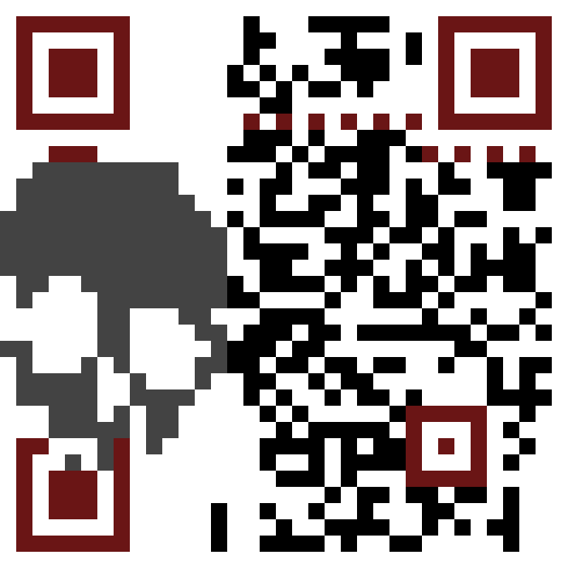
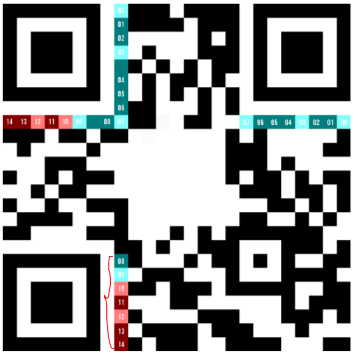

# Skull.png
## Description
Good Luck.  This was under the Misc category.

## tl;dr
We are given a png file that turns out to be a corrupted Qr Code. We have to identify the type of Qr Code and the associated pattern for reading bits. Then it is simply a matter of decoding  the bytes and converting to Ascii characters.

## Stenography Rabbit Hole
I initially thought that the challenge would be stenography related. I ran the image through several tools and nothing conclusive turned up.
 - Foremost
      - recover files based off of headers/footers.Similar to binwalk +dd  
      - It only recovered the same QR code with the skull.
  - Steghide 
      - Doesn't work with pngs. Conversion = lose data.
  - zsteg
      - It is a ruby package but it didn't turn anything up.
  - stegcracker
      - Manually going through the different channels to find any hidden data or something unique and repeating.
 ### PNG Chunks
After I gave up on the common stenography tools. I thought maybe the data was hidden abusing the data format for a `png`.  The header is 25 bytes long and the values seemed valid.
- Header bytes `89 50 4E 47 0D 0A 1A 0A`
- Footer bytes  `49 45 4E 44 AE 42 60 82`

After perusing the Wikipedia page, I thought Ancillary chunks might have been the key to finding the flag. Ancillary chunks are ignored if the software reading the image doesn't understand it. So it would take some malformed chunk header to disguise the flag.
#### Chunk Anatomy

| Length               	| Chunk type               	| Chunk data        	| CRC                     	|
|----------------------	|--------------------------	|-------------------	|-------------------------	|
|        4 bytes       	| 4 bytes                  	| See length block  	| 4 bytes                 	|
| how long is the data 	| what type of field is it 	| the actual data   	| cyclic redundancy check 	|                                         

[See Wikipedia for further information about chunks](https://en.wikipedia.org/wiki/Portable_Network_Graphics#%22Chunks%22_within_the_file)

The tool `pngcheck` verified that the file was a valid and detected the required Critical Chunks but no ancillary chunks.
 

   ## QR Code
  At this point, I exhausted the idea that the flag was hidden with stenography or within the data format of a `png`.
  I initially looked up previous CTF writeup's related to QR codes and the Wikipedia entry to learn about the specifications.
  1. I identified the version of the QR code as `Version 4` by manually counting the units where an unit is individual black or white square. There are 40 different versions of QR codes.
	  1.  Version 1 is 21x21 units and Version 4 is 177x177 units 
	  2.  The first 12 bits of the QR Codes store header information and are located in the bottom right corner.
		  1.  The first 4 bits are used to determine the type of data represented in the code. (Numeric, Alphanumeric, Binary,Kanji)
		  2.  The following 8 bits are used to store the length of the data

  2.  The next step was to understand to where and how  the format information is stored. [^1]
  
	  1.  The top left alignment square stores the Most Significant Bit (MSB) in the red box labeled `14`. The other two alignment squares are copies in case of damage to the QR Code. The given png only contains the Mask portion in the top right corner and the first 8 bits labeled `0-7` 
	  2.  With this given information, I referenced Wikipedia to determine the mask version which will be used prior to decoding the text blocks. Additionally since there are a limited amount of combinations, You can manually match the pattern for bits `0-7`. These bits will give you the level of Error Correction and the bits `12-10` will give you the mask. Skull.png is  Error Correction Level Low and Mask 2 `column % 3 ==0` 
	  3.  With this knowledge, It is obvious that the QR code is missing the Reed-Solomon Error correction code blocks.
  3.  At this point, I started to manually recreate the QR code using online tools. [^2][^3]

The following images were used to learn the pattern for decoding the data blocks to get the flag.


4. I hit a wall as I would initially get the following string  during my initial attempts at decoding `Grea~` . I was confused as the QR Code was correctly copied over and several online resources verified that it was the correct mask , QR code version and Error correction level. It took many days until I realized that the mask is effectively an XOR operation to break up chunks of the same color.  I wasn't applying the mask to the QR code so the moment I started in the third column, the values were in the extended ASCII range.
	1.  When applying the mask to the QR Code, for each unit in that row or column invert the value. Black --> White and White --> Black. 


  The flag
  ```
Great Job Decoding this! GPSCTF{97165cb7c87edd729b169fe51eb59b49}...UUUUUUUJªª
  ```
  
  
  
  

 ### Useful links
 [mma2015-qrcode](https://www.robertxiao.ca/hacking/ctf-writeup/mma2015-qrcode/)
 [another-mma writeup](http://ctf-for-beginners.blogspot.com/2015/09/write-up-mma-ctf-2015-qr-code-recovery.html)
[Medium writeup](https://medium.com/@nteezy/how-to-decode-a-partially-visible-or-damaged-qr-code-a-ctf-writeup-for-stack-the-flags-2020-4ef0eb6a018f)
 [Great resource on QR code creation ](https://www.thonky.com/qr-code-tutorial/introduction)
 [Exploring Error Correction](https://www.datagenetics.com/blog/november12013/index.html)


 [^1]: _Photo credit: @r00__ at Medium.com_ 
 [^2]:(https://merricx.github.io/qrazybox/) and  
 [^3]:(https://www.nayuki.io/page/creating-a-qr-code-step-by-step)
